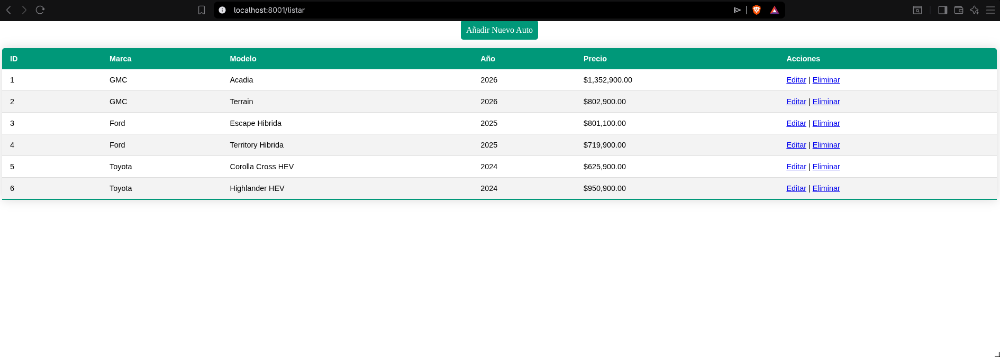
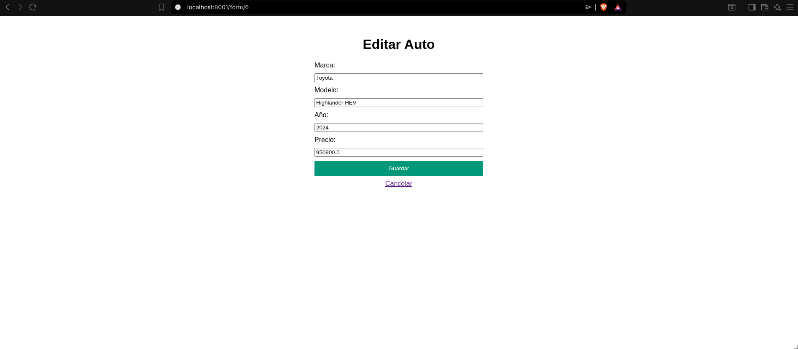
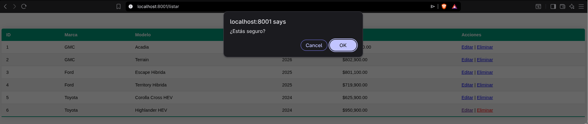
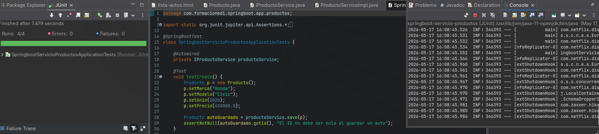

# Tarea 5: Vista de productos, programación de CRUD de productos y pruebas
### Materia: Seminario de Ciencias de la Computación B: Computación en la Nube
**Profesor:** Gustavo Márquez Flores

### Integrantes:
* **Luis Mario Solares Ramos** - No.cuenta: 321057110
* **Erick Luis Juarez**

---

## 1. Introducción
Esta práctica es la continuación de la tarea 4, donde hemos desarrollado en clase y en anteriores tarea varios microservicios, utilizando **Spring Boot**, **Spring Cloud (Eureka y Zuul API Gateway)** y el motor de plantillas **Thymeleaf**. 

El objetivo principal de esta tarea es reconfigurar el microservicio de productos (`springboot-servicio-productos`). Se implementa un ciclo CRUD completo (Create, Read, Update, Delete) con persistencia en una base de datos en memoria **H2**, una interfaz gráfica de usuario usando MVC, y se agregan algunos test utilizando **JUnit** para verificar el correcto funcionamiento de las operaciones.

## 2. Estructura
El desarrollo se configuró utilizando el IDE **Spring Tools for Eclipse**, importando los proyectos independientemente como proyectos Maven para asegurar el aislamiento de las dependencias de cada microservicio(manteniendo lo de las anteriores tareas):

* **springboot-servicio-eureka-server**: Servidor de descubrimiento centralizado
* **springboot-servicio-zuul-server**: API Gateway que intercepta, enruta y mide los tiempos de las solicitudes.
* **springboot-servicio-productos**: Microservicio encargado de la lógica de los autos, el almacenamiento H2 y las vistas de las interfaces HTML.


## 3. Vistas

### A. Controlador de Vistas (`ProductoController.java`)
Para permitir que Spring Boot procese correctamente el motor de Thymeleaf, la clase se anotó con la anotación `@Controller`. El mapeo principal del controlador ahora maneja las peticiones en la raíz `""` lo que hace más facil el acceso directo a los endpoints:

```java
@Controller
@RequestMapping("")
public class ProductoController {
    
    @Autowired
    private IProductoService productoService;

    @GetMapping({"/", "/listar", ""})
    public String listar(Model model) {
        model.addAttribute("productos", productoService.findAll());
        return "lista-autos";
    }

    @GetMapping("/form")
    public String crear(Model model) {
        model.addAttribute("producto", new Producto());
        return "form-auto";
    }

    @GetMapping("/form/{id}")
    public String editar(@PathVariable Long id, Model model) {
        Producto producto = productoService.findById(id);
        if(producto == null) {
            return "redirect:/listar";
        }
        model.addAttribute("producto", producto);
        return "form-auto";
    }

    @PostMapping("/form")
    public String guardar(Producto producto) {
        if (producto.getId() != null) {
            Producto productoOriginal = productoService.findById(producto.getId());
            producto.setCreateAt(productoOriginal.getCreateAt());
        }
        productoService.save(producto);
        return "redirect:/listar";
    }

    @GetMapping("/eliminar/{id}")
    public String borrarWeb(@PathVariable Long id) {
        productoService.delete(id);
        return "redirect:/listar";
    }
}
```
---

## 4. Capturas de Pantalla

### A. Lista de Autos
Muestra la tabla principal de lo inyectado desde `import.sql`
* URL de Acceso directo: `http://localhost:8001/listar`
* URL mediante Gateway Zuul: `http://localhost:8090/api/productos/listar`



### B. Nuevo Vehículo
Formulario para insertar un nuevo auto
* URL de Acceso: `http://localhost:8001/form`


### C. Editar auto
Vista para realizar actualizaciones del precio u otros campos que se pueden modificar del auto.



### D. Eliminar Auto
Se muestra una entana emergente del navegador para confirmar la eliminación. 



## 5. Pruebas Unitarias Automatizadas (JUnit)
Se agregaron algunas pruebas en `SpringbootServicioProductosApplicationTests.java` utilizando (`assertNotNull`, `assertTrue`, `assertEquals`, `assertNull`) para validar unitariamente el ciclo completo de los métodos del DAO a través del servicio:

```java
@SpringBootTest
class SpringbootServicioProductosApplicationTests {

    @Autowired
    private IProductoService productoService;

    @Test
    void testCreate() {
        Producto p = new Producto();
        p.setMarca("Honda");
        p.setModelo("Civic");
        p.setAnio(2026);
        p.setPrecio(450000.0);
        Producto autoGuardado = productoService.save(p);
        assertNotNull(autoGuardado.getId(), "El ID no debe ser nulo al guardar un auto");
    }

    @Test
    void testRead() {
        List<Producto> productos = productoService.findAll();
        assertTrue(productos.size() > 0, "La lista de productos no debería estar vacía");
    }

    @Test
    void testUpdate() {
        Producto p = productoService.findById(1L);
        assertNotNull(p, "El producto con ID 1 debe existir");
        
        Double nuevoPrecio = 1500000.0;
        p.setPrecio(nuevoPrecio);
        productoService.save(p);
        
        Producto actualizado = productoService.findById(1L);
        assertEquals(nuevoPrecio, actualizado.getPrecio(), "El precio debería haberse actualizado al nuevo valor");
    }

    @Test
    void testDelete() {
        Producto p = new Producto();
        p.setMarca("Nissan");
        p.setModelo("Versa");
        p.setAnio(2025);
        p.setPrecio(300000.0);
        Producto guardado = productoService.save(p);
        
        Long idPrueba = guardado.getId();
        assertNotNull(idPrueba);
        
        productoService.delete(idPrueba);
        
        Producto borrado = productoService.findById(idPrueba);
        assertNull(borrado, "El producto debería ser nulo después de ser eliminado");
    }
}
```

### Evidencia de los test
Captura que demuestra que los 4 métodos de la prueba se ejecutaron de forma exitosa:


